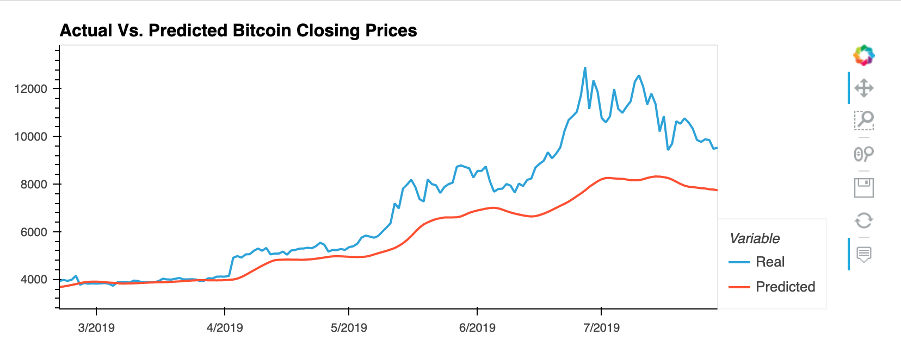
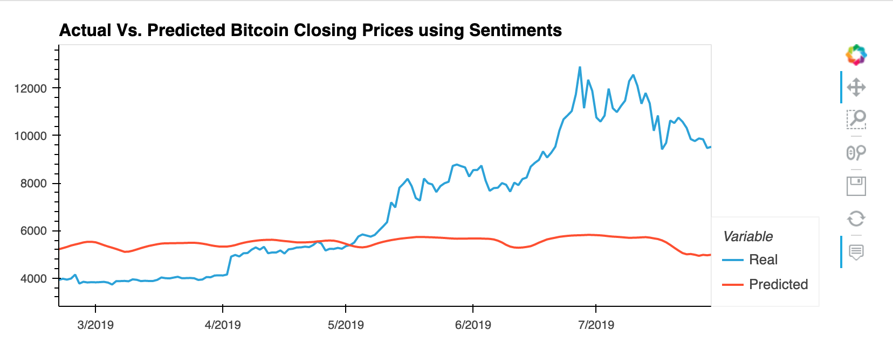

# DeepLearning Example

## Takeaways:

Q:  Which model has a lower loss?                                                                                                                                    
A:  LSTM Stock Predictor Using Closing Prices model had a lower loss score of: 0.0450, which was better than loss score of 0.1373 for LSTM Stock Predictor Using Fear and Greed Index model.

Q: Which model tracks the actual values better over time?                                                                                                            
A: LSTM Stock Predictor Using Closing Prices model tracks the actual values better over time.

Q: Which window size works best for the model?                                                                                                                      
A: I tested many different combinations for training and testing models. I achieved best results by using window size =10, number units = 20, 
   dropout fraction = 0.2, epochs=10, and batch size=2.

Here are the HVPLOTs, which didn't render on github...

